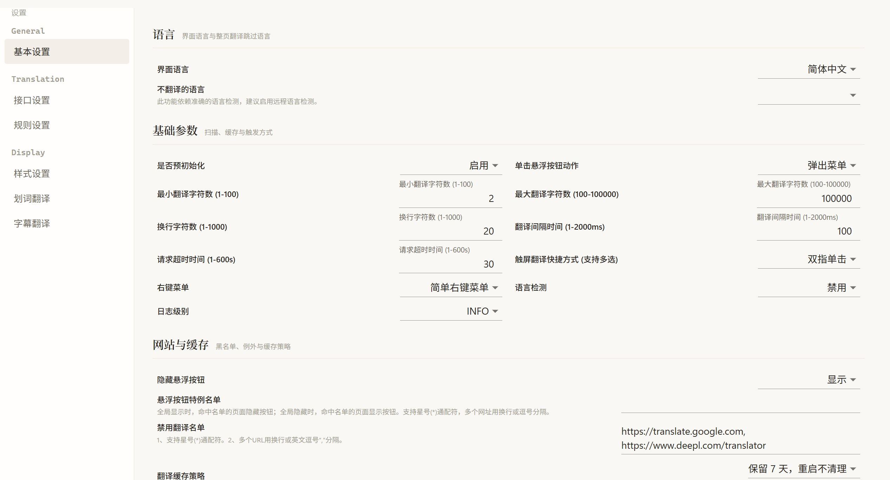
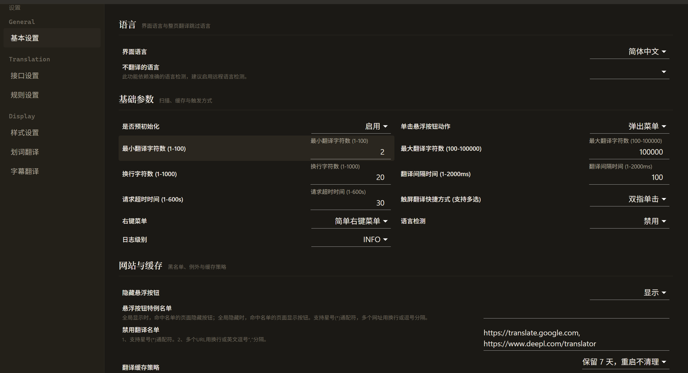

# LingoFlow

[中文](README.md) · [English](README.en.md)

**v1.3.0** · [Download the latest release](https://github.com/Guivyn/lingoflow/releases/latest) · [CI](https://github.com/Guivyn/lingoflow/actions/workflows/ci.yml)

<p align="center">
  
</p>

LingoFlow is a lightweight, open-source Chrome extension for reading foreign-language content with the original text and translation side by side.

## Interface preview

The Options page supports light and dark themes. The main preview shows language, translation, and website/cache settings; the dark theme is inside the disclosure below.

<p align="center">
  
</p>

<details>
  <summary>View the dark theme</summary>

  <p align="center">
    
  </p>
</details>

## Get started in 30 seconds

### Download a release (recommended)

1. Download `chrome.zip` from the [latest release](https://github.com/Guivyn/lingoflow/releases/latest).
2. Unzip it, open `chrome://extensions`, and enable Developer mode.
3. Click **Load unpacked** and select the extracted folder.
4. Open any foreign-language webpage, click the LingoFlow toolbar icon, or press `Alt+S` to toggle whole-page translation.
5. Select text to use the translation bubble; open a YouTube video to use bilingual subtitles.

The current default configuration uses Microsoft's built-in translation endpoint, so you can try it first. Other services may require an API key, endpoint, or local service.

### Build from source

The current CI environment uses Node.js 20 and pnpm 11.18.0; the repository pins pnpm through `.pnpm-version`.

```bash
git clone https://github.com/Guivyn/lingoflow.git
cd lingoflow
pnpm install
pnpm build
```

The build output is written to `build/chrome/`; load that directory from `chrome://extensions`. To create a release archive, run `pnpm build+zip`; the output is `build/chrome.zip`.

## Use cases

- **Whole-page translation**: automatic scanning, rule matching, and SPA mutation observation for bilingual article reading.
- **Selection and hover translation**: translate a word, phrase, or paragraph inline, in a translation box, or in a hover bubble.
- **YouTube subtitles**: bilingual display, sentence splitting, subtitle styles, and optional AI-assisted segmentation.
- **Dictionary and suggestions**: English dictionary lookup, input suggestions, and comparison across translation engines.

## How it works

- Automatic scanning handles common pages; built-in rules and SPA observation cover more complex sites.
- Whole-page, selection, and hover translation use separate presentation modes suited to each reading context.
- YouTube subtitles use an independent processing pipeline; AI segmentation is an optional enhancement, not a prerequisite.

## Engines and configuration

- **Machine translation**: Google, Google2, Microsoft, DeepL, and DeepLX.
- **AI translation**: DeepSeek, OpenAI, and Custom, with streaming, batch aggregation, context, prompts, hooks, and glossary support where supported by the selected interface.

See [docs/custom-api_v2.md](docs/custom-api_v2.md) for custom endpoints and hooks, and [docs/DESIGN.md](docs/DESIGN.md) for the interface design system.

## Shortcuts

| Chrome global shortcut | Action |
| --- | --- |
| `Alt+K` | Open the extension popup |
| `Alt+S` | Toggle whole-page translation |
| `Alt+C` | Toggle translation styles |

The active global bindings are shown in `chrome://extensions/shortcuts`. Page-level and selection shortcuts can be customized in the extension settings.

## Permissions and data

- LingoFlow requests `<all_urls>` so it can read and insert translations on arbitrary webpages; `storage`, `scripting`, and context-menu permissions support configuration, injection, and page actions.
- Translation text is sent to the provider you select. Endpoint, API-key, and data-retention policies vary by service.
- Configuration and translation caches are managed by browser-local storage. Do not put API keys in screenshots, Issues, or logs.

## Development

```bash
pnpm install
pnpm start       # local development, starting at the Options page
pnpm test        # unit tests
pnpm test:ci     # one non-interactive test run
pnpm lint        # ESLint
pnpm build       # build the Chrome extension into build/chrome/
```

## Contributing

- [Report a bug](https://github.com/Guivyn/lingoflow/issues/new?template=bug_report.md)
- [Request a feature](https://github.com/Guivyn/lingoflow/issues/new?template=feature_request.md)
- Use [Issues](https://github.com/Guivyn/lingoflow/issues) for other discussions.

## Acknowledgements

LingoFlow is based on core code from [fishjar/kiss-translator](https://github.com/fishjar/kiss-translator) (GPL-3.0). The page scanner, rule matching, translation renderer, YouTube subtitle pipeline, and UI design system were rewritten on top of that foundation.

## License

[GPL-3.0](LICENSE)
