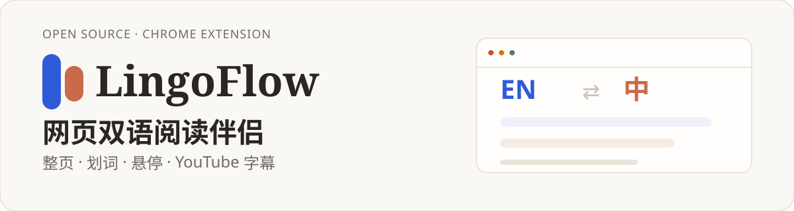
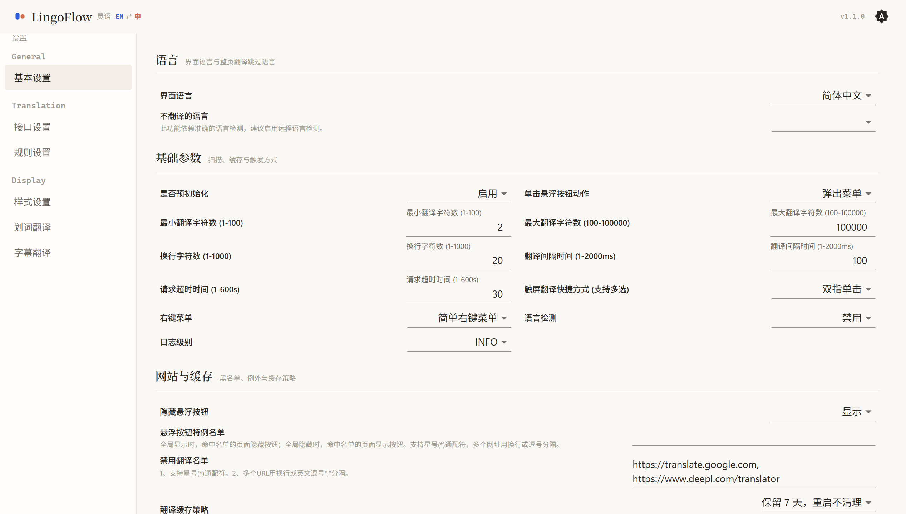
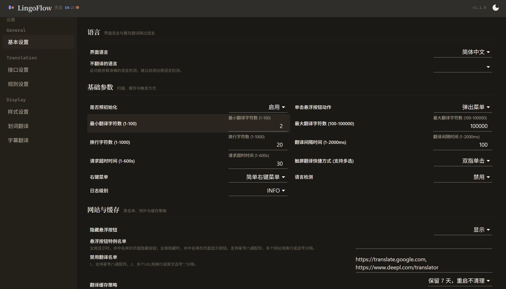

# LingoFlow（灵语）

**当前版本：v1.3.0** · [Releases 下载](https://github.com/Guivyn/lingoflow/releases)

<p align="center">
  
</p>

LingoFlow 是一款轻量、开源的 Chrome 双语翻译扩展。它把网页、划词、悬停段落和 YouTube 字幕变成随时可对照的双语阅读体验，适合经常阅读外文网页、希望即时理解内容的用户。

## 界面预览

<p align="center">
  
  
</p>

## 它是什么

LingoFlow 为阅读外文网页的常见场景提供一套连续的双语对照体验：整页翻译负责文章主体，悬停翻译照顾段落级细节，划词翻译用于单词和短句，YouTube 字幕翻译则让视频内容也能跟着原文逐句对照。

## 为什么不同

- 自动扫描与规则匹配并行：绝大多数页面无需手写规则即可整页翻译，复杂站点再由内置规则与 SPA 动态监听兜底。
- 按阅读场景提供交互面：整页、悬停、划词各有独立呈现方式，而不是把所有功能塞进同一个弹窗。
- YouTube 字幕是一条独立管线：内置句子切分、AI 分句增强与独立字幕样式，不是简单地把文本丢给翻译接口。
- 界面按阅读伴侣重新设计：衬线标题、无衬线正文、等宽数据，暖米白与陶土色体系，规范见 [docs/DESIGN.md](docs/DESIGN.md)。

## 功能

- 整页翻译：规则匹配、自动扫描、SPA 动态监听
- 悬停翻译：行内插入或悬浮气泡两种模式
- 划词翻译：多引擎对照、英文词典、输入联想
- YouTube 字幕：双语显示、句子切分、AI 分句增强
- 翻译引擎：Google、Google2、Microsoft、DeepL、DeepLX、DeepSeek、OpenAI、Custom
- 高级能力：流式输出、批处理聚合、上下文记忆、自定义 Prompt 与 Hook、术语表

自定义翻译接口的接入与 Hook 说明见 [docs/custom-api_v2.md](docs/custom-api_v2.md)。

## 安装

### 方式一：直接安装 Release 包（推荐）

1. 前往 [Releases](https://github.com/Guivyn/lingoflow/releases) 下载最新版（当前 **v1.3.0**）的 `chrome.zip`
2. 解压到任意本地目录
3. 打开 `chrome://extensions`，启用“开发者模式”
4. 点击“加载已解压的扩展程序”，选择解压后的目录

### 方式二：从源码构建

需要 Node.js 18+ 与 pnpm 10+（仓库通过 `.pnpm-version` 固定版本）。

```bash
git clone https://github.com/Guivyn/lingoflow.git
cd lingoflow
pnpm install
pnpm build
```

构建产物统一输出到 `build/chrome/`，加载扩展时请固定使用该目录：

1. 打开 `chrome://extensions`
2. 启用“开发者模式”
3. 点击“加载已解压的扩展程序”，选择 `build/chrome` 目录

发布打包使用 `pnpm build+zip`，产物为 `build/chrome.zip`。

## 快捷键

| 快捷键 | 作用 |
| --- | --- |
| `Alt+K` | 打开设置弹窗 |
| `Alt+S` | 切换整页翻译 |
| `Alt+C` | 切换译文样式 |

## 开发

```bash
pnpm install
pnpm start    # 本地开发，入口为 Options 设置页
pnpm test     # 单元测试
pnpm lint     # ESLint
pnpm build    # 构建 Chrome 扩展（自动同步版本号），产物输出到 build/chrome/
```

## 致谢

LingoFlow 的核心代码借鉴自 [fishjar/kiss-translator](https://github.com/fishjar/kiss-translator)（GPL-3.0）。<br>
我们保留了在此基础上重写了页面扫描、规则匹配、译文渲染、YouTube 字幕管线与全新 UI 设计系统。<br>
感谢 fishjar 与 kiss-translator 社区的开源贡献。<br>
如果你喜欢 KISS Translator，也请到上游仓库点一个 Star。

## 许可证

GPL-3.0
